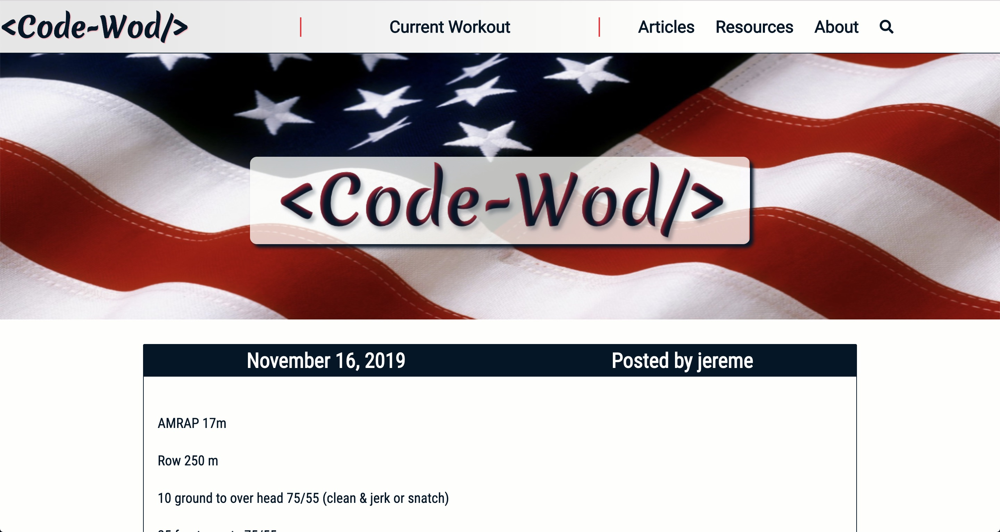
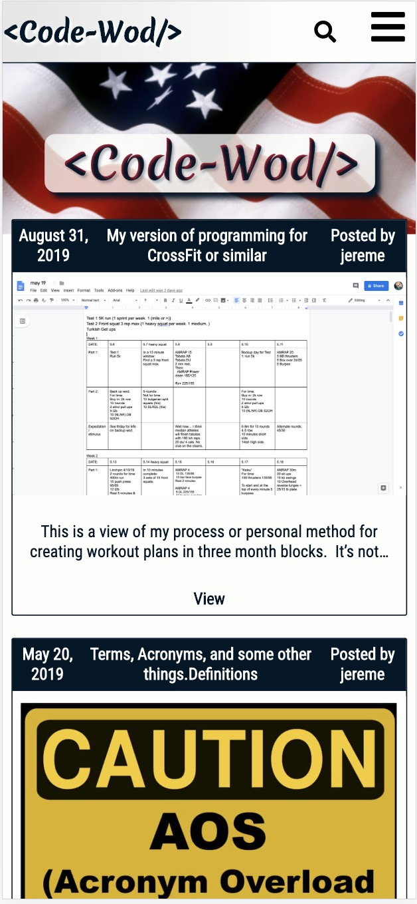
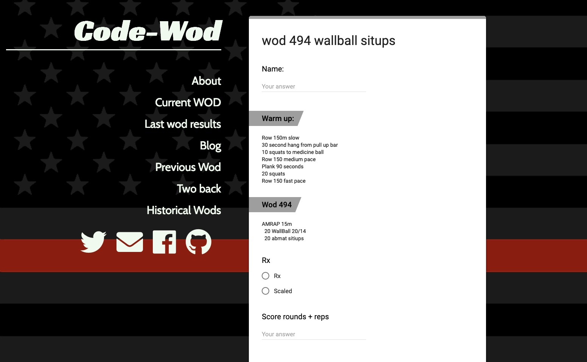
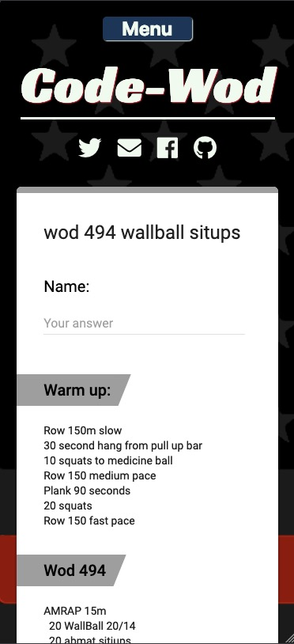
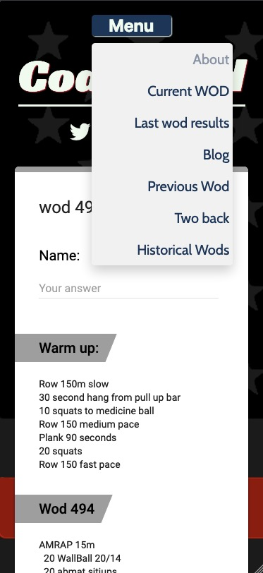
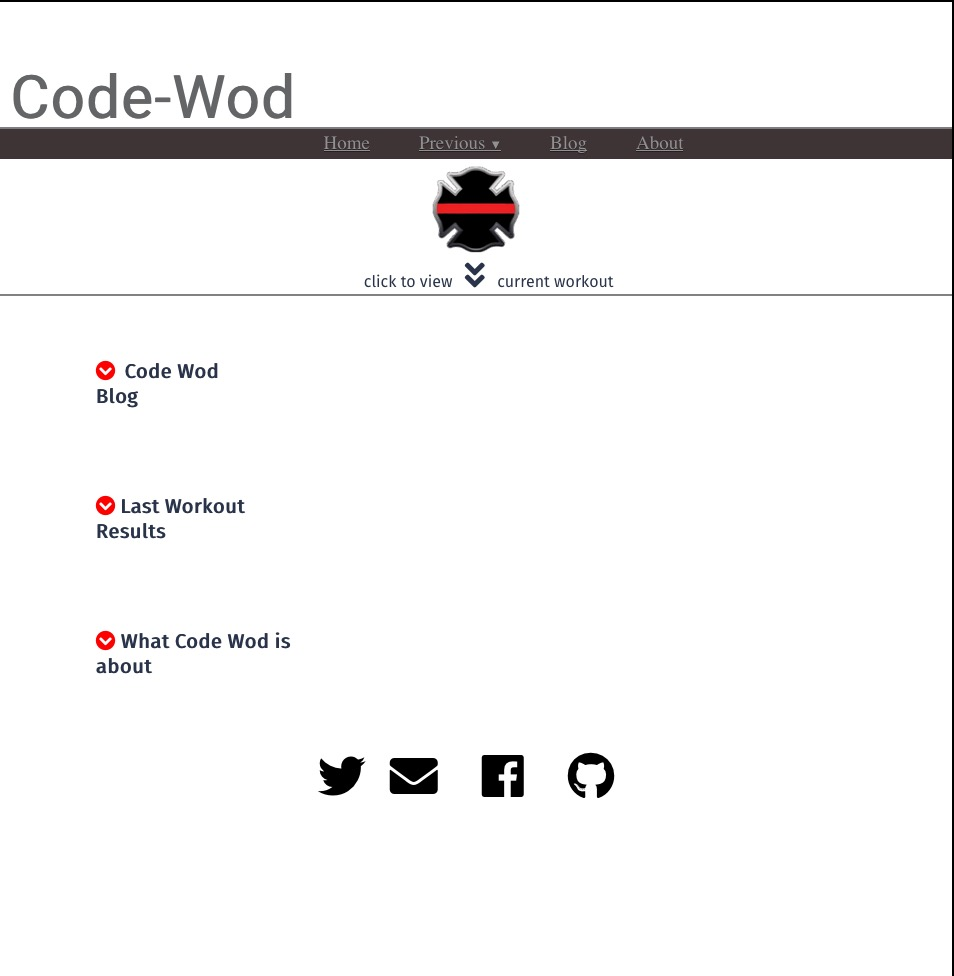
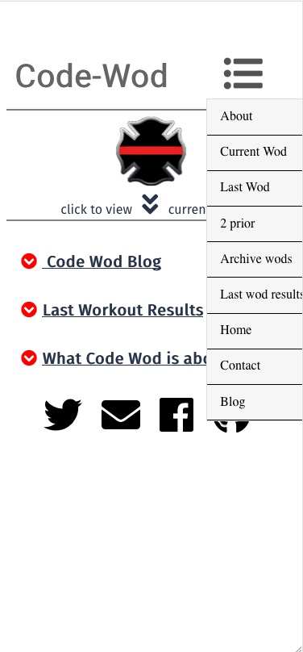

# -Code-Wod-
### [Link to the original article](https://www.code-wod.com/"Link to article")
## Desktop screenshot

### Full custom WordPress theme. Features WordPress as a headless CMS (content management system).  The theme is constructed entirely from scratch.  Code-wod makes use of 3 different custom post types.  The blog is the primary for daily updated workouts.  
### Mobile screenshot

### About this website:
 ###### Code-Wod.com is the 3rd version of a personal passion project.  The previous two versions represent my growth as a developer. 
 ### What is code-wod?
 ###### Code-wod began as an email to fire department members every third day.  Then it grew to a google form and eventually to custom websites.  Code-wod before it was code-wod began well before my code journey began.  It's now a simple way for First Responders (or anyone) to have a new workout every third day. It's interactive and allows everyone to post comments and scores to each of the workouts.  Included on the site are some articles I've writen.  
 ## Screen shots of Desktop and Mobile versions of the previous code-wod sites.
 
 ### Mobile view
 
 ### Mobile view (menu shown)
  
### Going even further back to the FIRST versions. 
###### This was my first attempt at a webiste. While there's a lot wrong with it, I'm still quite proud of it. 
 
 ### Mobile View
 
