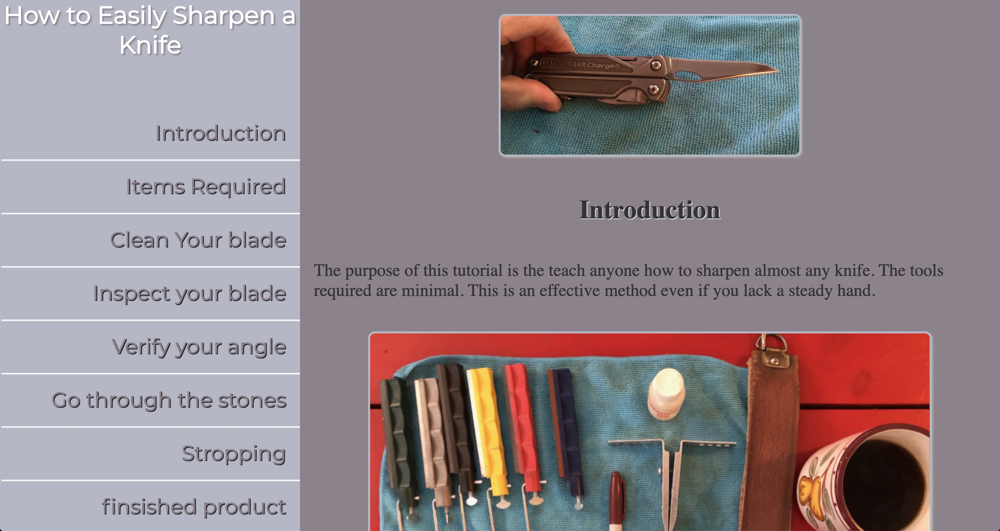

# -How to Sharpen a knife-
### [Link to the original article](http://jeremedaniels.com/sharpen/ "Link to article")
## Desktop screenshot

### Single day project created entirely for a job interview. I enjoyed creating it.  I have also kept it because it has been usefull for friends. 
## Mobile device screenshot

###### Technologies used are very basic.  This is a page designed mobile first using HTML, SASS, PHP, and JavaScript.  There's no database used, no CMS.  All images and video were also created in the same day by me.  